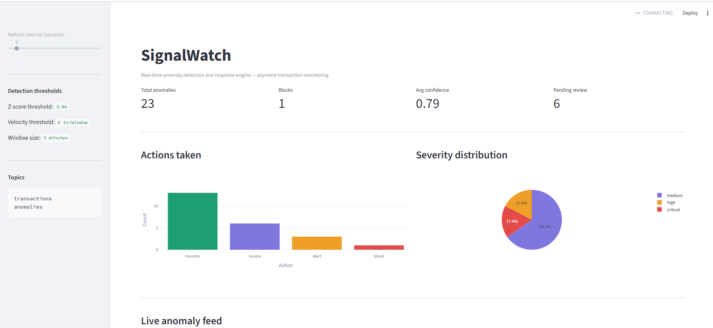

# SignalWatch:A Real-Time Anomaly Detection and Response Engine

A real-time streaming intelligence system that detects anomalous payment transactions as they happen and uses GPT-4o to reason about whether they represent genuine threats.

---

## What it does

A transaction arrives: *user_002 charges KES 2,500 at an electronics store in Lagos.*

SignalWatch:
1. Ingests the transaction from the Kafka stream in under 100ms
2. Updates the user's 5-minute sliding window statistics
3. Detects: amount 21σ from mean + foreign country — publishes to anomalies topic
4. GPT-4o reasons about the anomaly in context — two coherent signals = critical threat
5. Response engine issues block with 0.95 confidence
6. Full audit trail written to PostgreSQL
7. Live dashboard updates in real time

---

## Dashboard



---

## Architecture
```
TransactionProducer → [transactions topic] → WindowProcessor
                                                    ↓
                              AnomalyDetector (Z-score + IQR + velocity + geographic)
                                                    ↓
                                          [anomalies topic]
                                                    ↓
                                      GPT-4o LLM Reasoner
                                                    ↓
                              ResponseEngine (block / alert / review / monitor)
                                                    ↓
                                     PostgreSQL audit store
```

See [ARCHITECTURE.md](ARCHITECTURE.md) for detailed design decisions and trade-offs.

---

## Evaluation results

Measured on 23 anomaly events from integration testing:

| Metric | Value |
|--------|-------|
| Avg LLM confidence | 0.787 |
| High confidence rate | 74% |
| Geographic anomalies | 35% |
| Action: monitor | 57% |
| Action: review | 26% |
| Action: alert | 13% |
| Action: block | 4% |

---

## Stack

| Component | Technology |
|-----------|------------|
| Event streaming | Apache Kafka 7.5 + ZooKeeper |
| Stream processing | Python kafka-python |
| Window statistics | Pure Python deque (numpy-free) |
| Statistical detection | Z-score + IQR + velocity + geographic |
| AI reasoning | GPT-4o (structured JSON output) |
| Audit store | PostgreSQL 15 |
| API | FastAPI |
| Dashboard | Streamlit + Plotly |

---

## Quick start
```bash
git clone https://github.com/sogodongo/signalwatch
cd signalwatch
python3 -m venv venv && source venv/bin/activate
pip install -r requirements.txt
cp .env.example .env
# Add OPENAI_API_KEY to .env
docker compose up -d
# Terminal 1 — run the producer
python3 -m streaming.producers.transaction_producer
# Terminal 2 — run the dashboard
streamlit run dashboard/app.py --server.port 8503
```

---

## API endpoints

| Endpoint | Method | Description |
|----------|--------|-------------|
| /health | GET | Service health check |
| /stream/status | GET | Kafka topic stats |
| /anomalies | GET | Recent anomaly feed |
| /anomalies/{id} | GET | Full audit detail |
| /metrics | GET | Detection metrics |
| /inject | POST | Inject synthetic anomaly |

Interactive docs at `http://localhost:8002/docs`

---

## Running evaluations
```bash
python3 evaluation/eval_runner.py
python3 tests/test_integration.py
```

---

## Project status

| Week | Focus | Status |
|------|-------|--------|
| Week 1 | Kafka streaming + statistical detection | Done |
| Week 2 | LLM reasoning + response engine + API | Done |
| Week 3 | Dashboard + evaluation + docs | Done |
